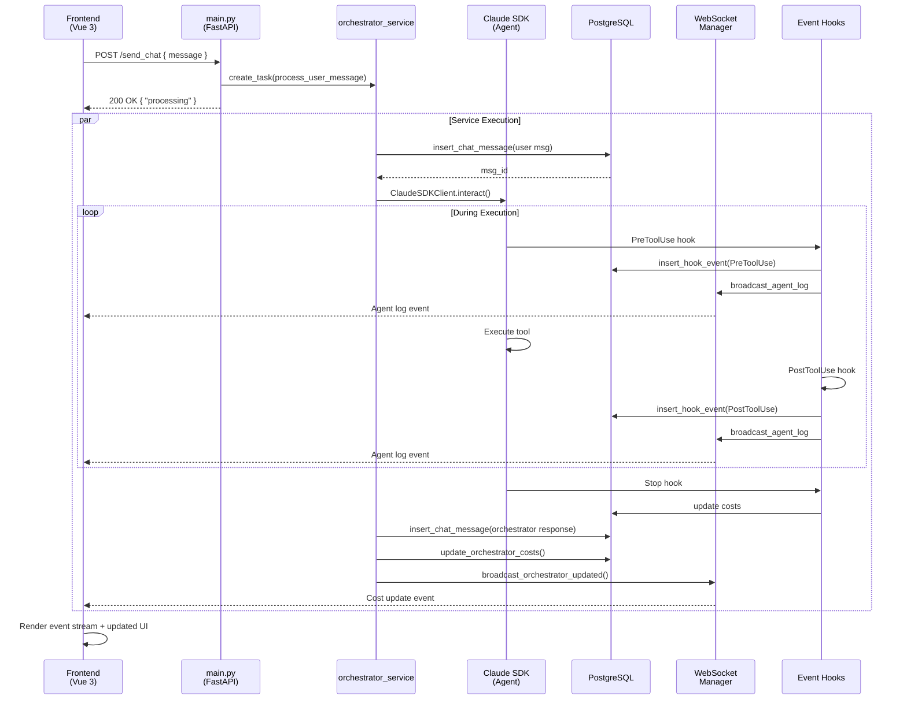

# Backend Architecture Diagrams

## Module Relationship Map

---

## Data Flow: User Message Processing

---

## Component Interaction: Agent Creation

---

## Database Schema Relationships

---

## Request/Response Processing Pipeline

---

## Module Dependency Tree

---

## API Endpoints Overview

---

## Event Broadcasting Architecture

---

## State Management & Lifecycle

---

## Configuration Layers

---

## Error Handling Flow

