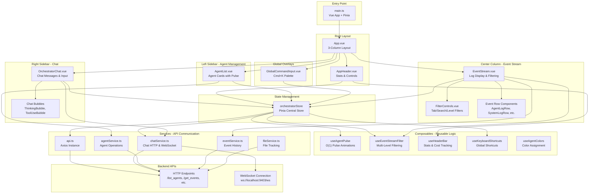
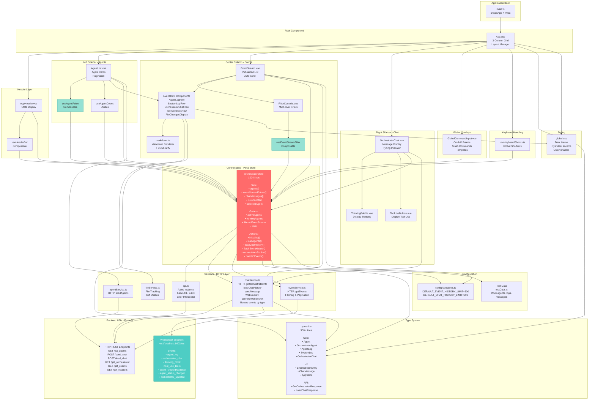
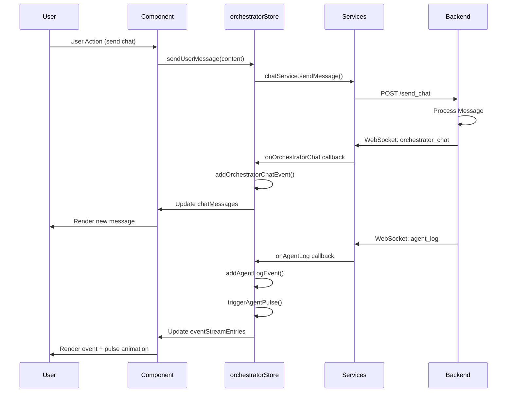
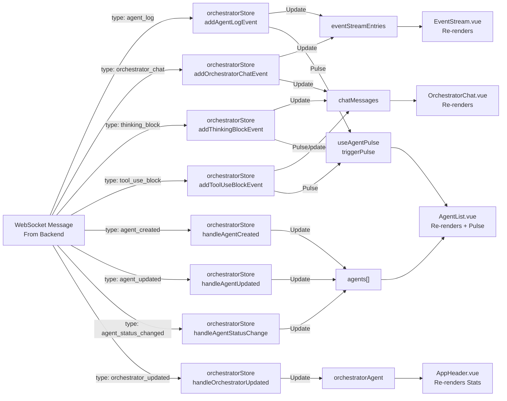

# Frontend Structure & Architecture Summary

## Overview

The orchestrator_3_stream frontend is a **Vue 3 + TypeScript + Pinia** single-page application that provides real-time visualization and management of multi-agent orchestration. It uses WebSocket for live event streaming and Axios for HTTP API communication with a FastAPI backend.

**Key Technologies:**
- Vue 3 (Composition API)
- TypeScript for type safety
- Pinia for state management
- Vite for build tooling
- Axios for HTTP communication
- WebSocket for real-time updates
- DOMPurify for XSS protection
- Highlight.js for code syntax highlighting
- Marked for markdown rendering

---

## Key Frontend Nodes - Quick Reference

**Components:**
- **App.vue**: Root 3-column grid layout managing agents, events, and chat sidebars
- **AppHeader.vue**: Displays real-time stats (active/running agents, logs, cost) and control buttons
- **AgentList.vue**: Left sidebar rendering agent cards with O(1) pulsing animations on events
- **EventStream.vue**: Center column displaying filtered/searchable log entries with auto-scroll
- **OrchestratorChat.vue**: Right sidebar chat interface with typing indicator and multiple message types
- **GlobalCommandInput.vue**: Cmd+K command palette overlay showing slash commands and agent templates
- **FilterControls.vue**: Multi-level filter UI combining agent, level, category, tool, and regex search filters

**Composables (Reusable Logic):**
- **useAgentPulse**: O(1) Set-based composable managing pulsing animations for high-frequency events
- **useEventStreamFilter**: Provides multi-dimensional filtering, regex search, and filter state management
- **useHeaderBar**: Aggregates stats, cost tracking, and CWD computations for header display
- **useKeyboardShortcuts**: Handles global keyboard events (Cmd+K / Ctrl+K)

**Services (API Communication):**
- **chatService.ts**: Manages WebSocket connection and HTTP chat (messages, history, streaming)
- **agentService.ts**: HTTP operations for agent management and list queries
- **eventService.ts**: HTTP queries for event history with filtering and pagination
- **api.ts**: Centralized Axios instance with error handling and base URL configuration

**Core Files:**
- **orchestratorStore.ts**: Central Pinia store managing agents, events, chat, WebSocket connection
- **types.d.ts**: 50+ TypeScript interfaces mirroring database models and UI types

---

## Directory Structure

```
frontend/
├── src/
│   ├── main.ts                          # Vue app entry point & Pinia setup
│   ├── App.vue                          # Root component (3-column layout)
│   ├── types.d.ts                       # TypeScript interface definitions
│   │
│   ├── components/                      # Vue components
│   │   ├── AppHeader.vue               # Top header with stats and controls
│   │   ├── AgentList.vue               # Left sidebar: agent list with pulsing
│   │   ├── EventStream.vue             # Center: live event log display
│   │   ├── OrchestratorChat.vue        # Right sidebar: chat interface
│   │   ├── FilterControls.vue          # Filter UI component
│   │   ├── GlobalCommandInput.vue      # Cmd+K command palette
│   │   ├── chat/                       # Chat-specific components
│   │   │   ├── ThinkingBubble.vue     # Displays orchestrator thinking blocks
│   │   │   └── ToolUseBubble.vue      # Displays tool use actions
│   │   └── event-rows/                 # Event row renderers
│   │       ├── AgentLogRow.vue
│   │       ├── SystemLogRow.vue
│   │       ├── OrchestratorChatRow.vue
│   │       ├── AgentToolUseBlockRow.vue
│   │       ├── FileChangesDisplay.vue
│   │       └── ToolUseBlockRow.vue
│   │
│   ├── stores/                          # Pinia state management
│   │   └── orchestratorStore.ts        # Main application state & actions
│   │
│   ├── composables/                    # Vue composables for logic reuse
│   │   ├── useAgentPulse.ts           # Manages pulsing animations (O(1) optimized)
│   │   ├── useEventStreamFilter.ts    # Event filtering & search logic
│   │   ├── useHeaderBar.ts            # Header stats & cost tracking
│   │   ├── useAgentColors.ts          # Agent color assignment utilities
│   │   └── useKeyboardShortcuts.ts    # Global keyboard handlers (Cmd+K)
│   │
│   ├── services/                       # HTTP/WebSocket communication
│   │   ├── api.ts                     # Axios instance with error handling
│   │   ├── chatService.ts             # Chat HTTP & WebSocket handlers
│   │   ├── agentService.ts            # Agent HTTP operations
│   │   ├── eventService.ts            # Event history HTTP queries
│   │   └── fileService.ts             # File tracking utilities
│   │
│   ├── utils/                          # Utility functions
│   │   ├── markdown.ts                # Markdown rendering with XSS protection
│   │   └── agentColors.ts             # Color palette utilities
│   │
│   ├── config/                         # Configuration constants
│   │   └── constants.ts               # API limits, defaults
│   │
│   ├── data/                           # Test/mock data
│   │   └── testData.ts                # Sample agents, logs, chat for UI dev
│   │
│   └── styles/
│       └── global.css                  # Dark theme with cyan/teal accents
│
├── vite.config.ts                      # Vite configuration
├── index.html                          # HTML entry point
├── package.json                        # Dependencies
└── tsconfig.json                       # TypeScript config
```

---

## Component Architecture Diagram



---

## State Management (Pinia Store)

### orchestratorStore.ts (1004 lines)

**Central state container** managing all application data and WebSocket connections.

#### State Variables
| Variable | Type | Purpose |
|----------|------|---------|
| `agents` | `Agent[]` | All active orchestrator agents |
| `selectedAgentId` | `string \| null` | Currently selected agent |
| `orchestratorAgentId` | `string` | Main orchestrator UUID |
| `orchestratorAgent` | `OrchestratorAgent \| null` | Main orchestrator metadata |
| `eventStreamEntries` | `EventStreamEntry[]` | All log events (1000+ entries) |
| `eventStreamFilter` | `EventStreamFilter` | Current filter mode |
| `autoScroll` | `boolean` | Auto-scroll to new events |
| `chatMessages` | `ChatMessage[]` | Conversation history |
| `isTyping` | `boolean` | Typing indicator state |
| `isConnected` | `boolean` | WebSocket connection status |
| `commandInputVisible` | `boolean` | Global command palette visibility |
| `chatWidth` | `'sm' \| 'md' \| 'lg'` | Chat panel width |
| `fileTrackingEvents` | `Map<string, any>` | File changes by parent log ID |

#### Key Computed Properties
- **`activeAgents`** - Non-archived, non-complete agents
- **`runningAgents`** - Agents with `status === 'executing'`
- **`selectedAgent`** - Current selected agent object
- **`filteredEventStream`** - Events filtered by type (errors/hooks/responses)
- **`stats`** - Aggregated AppStats for header display

#### Key Actions
- **Initialization**: `initialize()` → loads orchestrator info, connects WebSocket, loads agents/chat/events
- **Chat**: `loadChatHistory()`, `sendUserMessage()`, `clearChat()`, `toggleChatWidth()`
- **WebSocket**: `connectWebSocket()`, `disconnectWebSocket()`, handles all incoming events
- **Event Stream**: `addAgentLogEvent()`, `addOrchestratorChatEvent()`, `fetchEventHistory()`
- **Agent Management**: `loadAgents()`, `selectAgent()`, `updateAgent()`, `removeAgent()`
- **Events**: `addEventStreamEntry()`, `setEventStreamFilter()`, `toggleAutoScroll()`, `exportEventStream()`

#### WebSocket Event Handlers
- `onAgentLog` → Creates EventStreamEntry for agent activities
- `onOrchestratorChat` → Adds chat message to both event stream and chat UI
- `onThinkingBlock` → Displays orchestrator internal reasoning
- `onToolUseBlock` → Shows tool invocations with parameters
- `onAgentCreated/Updated/Deleted` → Updates agent list
- `onAgentStatusChange` → Real-time agent status updates
- `onOrchestratorUpdated` → Updates cost and token counts

---

## Component Details

### App.vue (220 lines)
**Root component** implementing the 3-column grid layout.

**Structure:**
- Header area
- Main grid: Left sidebar (agents) | Center (event stream) | Right (chat)
- Global command input overlay

**Features:**
- Responsive grid layout with breakpoints (1024px, 1200px, 1400px, 1600px)
- Sidebar collapse animation
- Dynamic chat width (sm/md/lg)
- Component communication via events

**Key Props/Events:**
- Emits filter changes to EventStream
- Handles agent selection with auto-filtering
- Manages sidebar collapse state

---

### AppHeader.vue (223 lines)
**Top navigation bar** displaying real-time statistics and controls.

**Displays:**
- Application title "MULTI-AGENT ORCHESTRATION"
- Connection status (green pulsing dot when connected)
- Live stats: Active agents, Running agents, Event log count, Total cost
- Action buttons: CLEAR ALL, PROMPT (Cmd+K)

**Dependencies:**
- `useHeaderBar()` composable for stats
- `orchestratorStore` for connection status

---

### AgentList.vue (834 lines)
**Left sidebar** showing paginated agent cards with real-time status and pulsing animations.

**Features:**
- Agent cards with status indicators (idle/executing/waiting/blocked/complete)
- Live token and cost counters
- Smooth pulsing animations triggered on tool use, hooks, thinking blocks
- Agent collapse toggle
- Search/filter by agent name
- Archived agent toggle view

**Key Composables:**
- `useAgentPulse()` → Triggers pulse animations on relevant events
- `useAgentColors()` → Assigns consistent colors to agents

---

### EventStream.vue (380 lines)
**Center column** displaying scrollable log entries with filtering and search.

**Features:**
- Virtualized list rendering for performance (1000+ entries)
- Multiple filter types: tabs, agent filters, quick level filters, search
- Regex search support across all event fields
- Auto-scroll to new entries
- Line numbers for easy reference
- Syntax highlighting in code blocks

**Props:**
- `events` - EventStreamEntry[] to display
- `currentFilter` - Active filter string
- `autoScroll` - Enable/disable auto-scroll

**Events:**
- `set-filter` - Emitted when filter changes

---

### OrchestratorChat.vue (662 lines)
**Right sidebar** chat interface for user-orchestrator communication.

**Features:**
- Message display with sender differentiation (user/orchestrator)
- Support for multiple message types: text, thinking blocks, tool use
- Typing indicator during orchestrator responses
- Input field with send button
- Auto-scroll to latest message
- Thinking and Tool Use bubble components

**Props:**
- `messages` - ChatMessage[] history
- `isConnected` - WebSocket connection status
- `isTyping` - Show typing indicator
- `autoScroll` - Enable/disable auto-scroll

**Events:**
- `send` - Emitted when user sends message

---

### FilterControls.vue (352 lines)
**Reusable filter UI component** displayed in EventStream.

**Sections:**
1. **Main Tabs** - Combined Stream view selector
2. **Quick Filters** - By log level (DBG, INF, WARN, ERR, OK)
3. **Category Filters** - RESPONSE, TOOL, THINKING, HOOK
4. **Agent Filters** - Dynamic list from event agents
5. **Tool Filters** - Specific tools used by agents
6. **Search Bar** - Regex or text search
7. **Auto-scroll Toggle** - Follow new entries

**Emitted Events:**
- `toggle-*-filter` - Various filter toggles
- `set-search` - Search query updates

---

### GlobalCommandInput.vue (710 lines)
**Command palette overlay** (Cmd+K / Ctrl+K).

**Displays:**
- System information panel (session ID, CWD, model info)
- Slash commands as cyan badges (from backend discovery)
- Agent templates as green badges (for spawning subagents)
- Search/filter commands
- Keyboard shortcuts help

**Data Sources:**
- Backend `/get_orchestrator` endpoint provides slash commands & templates

---

### Event Row Components

Located in `src/components/event-rows/`:

| Component | Purpose |
|-----------|---------|
| **AgentLogRow.vue** | Displays agent events with markdown content and file tracking |
| **SystemLogRow.vue** | System-level logs with level badge coloring |
| **OrchestratorChatRow.vue** | Chat messages with participant info |
| **ToolUseBlockRow.vue** | Tool invocations with parameters and results |
| **AgentToolUseBlockRow.vue** | Agent-specific tool usage display |
| **FileChangesDisplay.vue** | File modifications tracked by agents (diffs, summaries) |

**Common Features:**
- Markdown rendering with syntax highlighting
- DOMPurify XSS protection
- Timestamp display
- Agent/source identification
- Copy-to-clipboard buttons

---

## Composables (Reusable Logic)

### useAgentPulse.ts (120 lines)
**High-performance pulse animation manager** with aggressive debouncing.

**Key Features:**
- O(1) agent lookup using `Set<string>`
- Plain object for timer storage (faster than Map)
- Aggressive debouncing (400ms) prevents animation thrashing
- Batch Vue reactivity updates

**Exports:**
```typescript
triggerPulse(agentId)           // Start pulse animation
isAgentPulsing(agentId)         // Check if pulsing (O(1))
getAgentPulseClass(agentId)     // Get CSS class
clearAllPulses()                // Cleanup on disconnect
getPulsingAgents()              // Get all pulsing agents
isPulsing                       // Reactive Set for template bindings
```

**Performance:** Handles 1000+ simultaneous pulses with minimal CPU/GPU overhead.

---

### useEventStreamFilter.ts (362 lines)
**Comprehensive event filtering and search logic.**

**Filter Types:**
1. **Main Tabs** - "Combined Stream" (extensible)
2. **Agent Filters** - By agent name (dynamic from events)
3. **Category Filters** - RESPONSE, TOOL, THINKING, HOOK
4. **Tool Filters** - Specific tools used
5. **Quick Filters** - Log levels (DEBUG, INFO, WARNING, ERROR, SUCCESS)
6. **Search** - Regex or text search across multiple fields:
   - Content, event type, agent name
   - Summary, task slug, session ID
   - ADW fields, file paths
   - Orchestrator chat messages

**Exports:**
- State refs: `currentFilter`, `activeAgentFilters`, `searchQuery`, `autoScroll`
- Computed: `filteredEvents` (applies all filters)
- Helpers: `toggleQuickFilter()`, `toggleAgentFilter()`, etc.

---

### useHeaderBar.ts (217 lines)
**Header statistics and cost tracking composable.**

**Computed Properties:**
- `activeAgentCount` - Non-archived agents
- `runningAgentCount` - Currently executing
- `logCount` - Event stream size
- `orchestratorCost` - Main orchestrator spend
- `totalAgentCost` - All subagents spend
- `totalCombinedCost` - Total spend
- `costBreakdown` - Detailed breakdown object
- `cwd` - Current working directory

**Actions:**
- `fetchCwd()` - Load CWD from backend `/get_headers`
- `clearEventStream()` - Delegate to store
- `exportEventStream()` - Delegate to store

---

### useKeyboardShortcuts.ts
**Global keyboard event handlers.**

**Shortcuts:**
- **Cmd+K / Ctrl+K** - Toggle command palette

---

### useAgentColors.ts
**Consistent color assignment for agents.**

Generates stable colors from agent names/IDs for UI consistency.

---

## Services (API Communication)

### api.ts (42 lines)
**Axios instance with centralized configuration.**

**Configuration:**
- Base URL: `http://127.0.0.1:9403` (from `VITE_API_BASE_URL`)
- Timeout: 30 seconds
- Content-Type: application/json

**Error Interceptor:**
- Logs API errors to console
- Provides detailed error context (status, response data)

---

### chatService.ts (150+ lines)
**HTTP and WebSocket communication for chat and orchestrator interaction.**

**HTTP Methods:**
- `getOrchestratorInfo()` → GET `/get_orchestrator`
- `loadChatHistory(orchestratorAgentId, limit)` → POST `/load_chat`
- `sendMessage(message, orchestratorAgentId)` → POST `/send_chat`

**WebSocket Handler:**
- `connectWebSocket(url, callbacks)` → Establishes connection
- Routes by message type to appropriate callbacks:
  - `chat_stream`, `chat_typing`, `agent_log`
  - `orchestrator_chat`, `thinking_block`, `tool_use_block`
  - `agent_created`, `agent_updated`, `agent_deleted`
  - `agent_status_changed`, `agent_summary_update`
  - `orchestrator_updated`, `error`

---

### agentService.ts (16 lines)
**Agent management HTTP operations.**

**Methods:**
- `loadAgents()` → GET `/list_agents` returns all active agents

---

### eventService.ts (42 lines)
**Event history querying.**

**Methods:**
- `getEvents(params)` → GET `/get_events` with filters:
  - `agent_id` - Filter by agent
  - `task_slug` - Filter by task
  - `event_types` - "all" or comma-separated types
  - `limit` - Result limit (default 300)
  - `offset` - Pagination offset

**Response:** `{status, events: UnifiedEvent[], count}`

---

### fileService.ts
**File tracking and diff utilities.**

Handles file changes, reads, diffs, and summaries.

---

## Type Definitions (types.d.ts)

Comprehensive TypeScript interfaces mirroring backend database models:

### Core Types
- **`Agent`** - Subagent with tokens, cost, status
- **`OrchestratorAgent`** - Main orchestrator metadata
- **`AgentLog`** - Event log entry from agents
- **`SystemLog`** - System-level logging
- **`OrchestratorChat`** - Chat message

### UI Types
- **`EventStreamEntry`** - Unified event format for display
- **`ChatMessage`** - Union of TextChatMessage | ThinkingChatMessage | ToolUseChatMessage
- **`AppStats`** - Header statistics aggregation

### API Response Types
- **`GetOrchestratorResponse`** - Orchestrator info + slash commands + templates
- **`LoadChatResponse`** - Chat history with message array
- **`SendChatResponse`** - Send confirmation

---

## Styling & Theme

### global.css
**Dark theme** with cyan/teal accent colors.

**CSS Variables:**
- `--bg-primary`, `--bg-secondary`, `--bg-tertiary` - Background colors
- `--text-primary`, `--text-secondary`, `--text-muted` - Text colors
- `--accent-primary` - Cyan accent
- `--status-*` - Status indicator colors
- `--spacing-*` - Consistent spacing
- `--border-color` - Border styling
- `--font-mono` - Monospace font for code

**Utility Classes:**
- `.agent-pulsing` - Pulsing animation (GPU-accelerated)
- `.status-badge` - Status indicator styling
- `.event-row` - Event entry styling

---

## Data Flow & Real-Time Updates

```
Backend Events (WebSocket)
    ↓
chatService.connectWebSocket()
    ↓
orchestratorStore handlers
    ├→ addAgentLogEvent()
    ├→ addOrchestratorChatEvent()
    ├→ addThinkingBlockEvent()
    ├→ addToolUseBlockEvent()
    ├→ handleAgentStatusChange()
    └→ handleOrchestratorUpdated()
    ↓
Pinia store updates (agents, eventStreamEntries, chatMessages)
    ↓
Components reactively update
    ├→ AgentList (pulse animations)
    ├→ EventStream (new log entries)
    └→ OrchestratorChat (incoming messages)
```

---

## Performance Optimizations

1. **useAgentPulse**: O(1) Set-based lookups for high-frequency events
2. **Event Filtering**: Computed properties prevent re-filtering on every render
3. **Virtual Scrolling**: EventStream supports 1000+ entries without lag
4. **Batch Reactivity**: Array spread patterns trigger Vue reactivity once
5. **Debounced Pulse**: 400ms debounce prevents animation thrashing
6. **GPU-Accelerated Animation**: CSS `transform` and `will-change`

---

## Environment Variables

Located in `.env` (not committed):

```bash
VITE_API_BASE_URL=http://127.0.0.1:9403
VITE_WEBSOCKET_URL=ws://127.0.0.1:9403/ws
```

---

## Build & Development

**Build Tool:** Vite
- Lightning-fast HMR (Hot Module Replacement)
- TypeScript support via esbuild
- Vue 3 SFC compilation

**Development Server:** `npm run dev` (port 5175)
**Production Build:** `npm run build`
**Preview:** `npm run preview`

---

## Key Architectural Decisions

| Decision | Rationale |
|----------|-----------|
| **Pinia (not Context API)** | Centralized state prevents prop drilling in deep tree |
| **Composables** | Logic reuse without component coupling |
| **WebSocket** | Real-time updates without polling overhead |
| **Set data structures** | O(1) agent pulse lookups for high-frequency events |
| **Array spread for reactivity** | Explicit Vue 3 reactive updates (no implicit mutations) |
| **TypeScript interfaces** | Type safety prevents runtime errors |
| **DOMPurify** | XSS protection for user/agent-generated content |

---

## Testing & Validation

- Use **Playwright MCP** for frontend automation testing
- Test data in `src/data/testData.ts` for UI development
- Components support both real and mock WebSocket data

---

## File Size Summary

| File | Lines | Purpose |
|------|-------|---------|
| orchestratorStore.ts | 1004 | Central state management |
| AgentList.vue | 834 | Agent card display |
| OrchestratorChat.vue | 662 | Chat interface |
| GlobalCommandInput.vue | 710 | Command palette |
| useEventStreamFilter.ts | 362 | Filtering logic |
| EventStream.vue | 380 | Event log display |
| chatService.ts | 150+ | API communication |
| types.d.ts | 358+ | Type definitions |

---

## Summary

The frontend architecture is a **high-performance, real-time monitoring dashboard** built on Vue 3 with centralized Pinia state management. It handles 1000+ simultaneous events with O(1) performance optimizations, supports multi-dimensional filtering and search, and provides a smooth user experience through GPU-accelerated animations and responsive design.

Key strengths:
- ✅ Type-safe throughout
- ✅ Modular component structure
- ✅ Reusable composable logic
- ✅ Real-time WebSocket integration
- ✅ Performance-optimized for high-frequency events
- ✅ Comprehensive filtering and search
- ✅ Accessible and responsive design

---

## Extended Architecture Diagram - Detailed Dependencies



---

## Component Dependency Matrix

| Component | Depends On | Purpose |
|-----------|-----------|---------|
| **App.vue** | orchestratorStore, useKeyboardShortcuts | Root layout & event routing |
| **AppHeader.vue** | useHeaderBar, orchestratorStore | Statistics display |
| **AgentList.vue** | orchestratorStore, useAgentPulse, useAgentColors | Agent visualization |
| **EventStream.vue** | orchestratorStore, useEventStreamFilter, Event Rows | Event log display |
| **OrchestratorChat.vue** | orchestratorStore, chat bubbles | Chat interface |
| **GlobalCommandInput.vue** | orchestratorStore, chatService | Command palette |
| **Event Row Components** | markdown.ts, DOMPurify | Event rendering |
| **orchestratorStore** | chatService, agentService, eventService | Central state |
| **chatService.ts** | api.ts, types | WebSocket & HTTP |
| **agentService.ts** | api.ts | Agent operations |
| **eventService.ts** | api.ts | Event queries |
| **useAgentPulse** | (standalone) | Animation management |
| **useEventStreamFilter** | (standalone) | Filter logic |
| **useHeaderBar** | orchestratorStore, types | Header state |

---

## State Flow Diagram



---

## WebSocket Event Processing Flow



