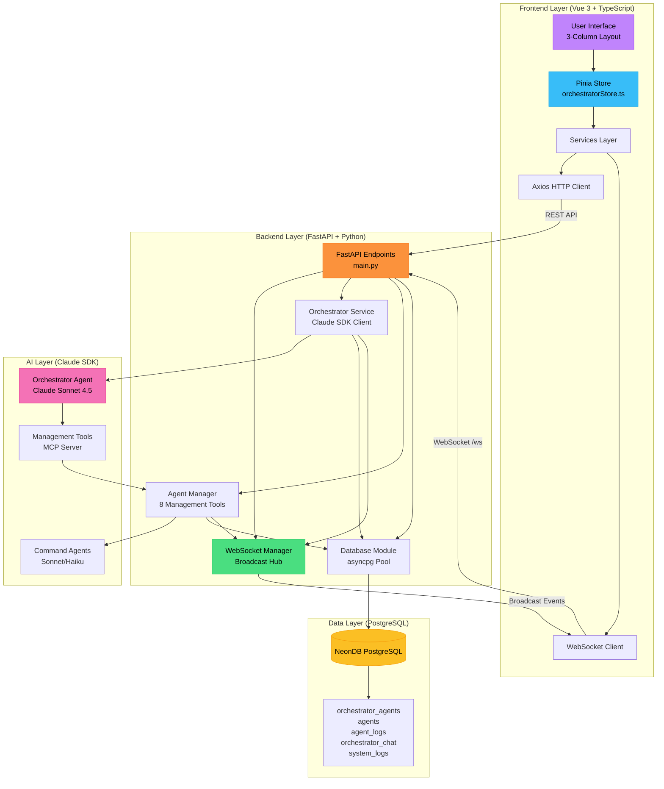
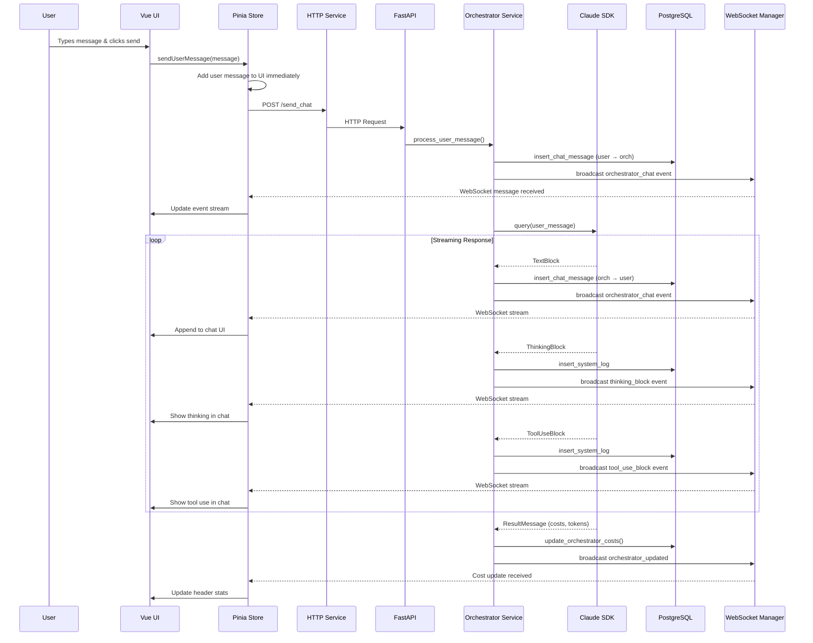
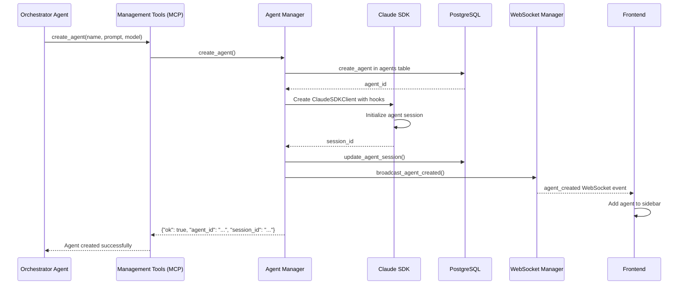
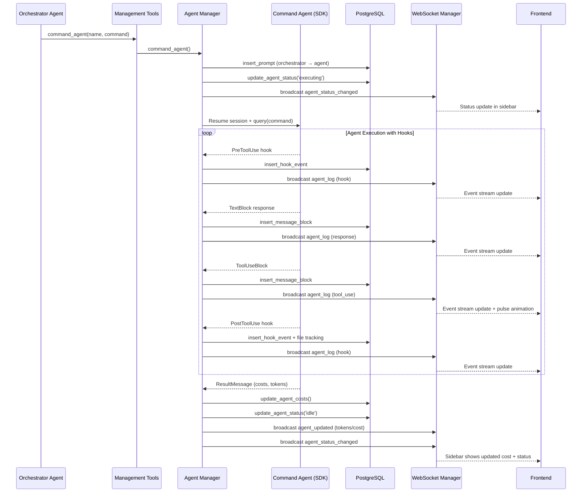
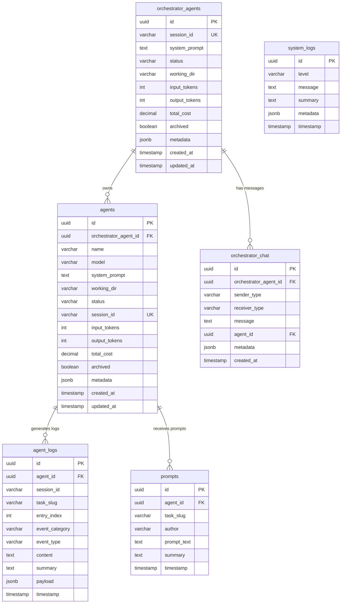

# Orchestrator 3 Stream - Full-Stack Architecture Summary

**Date:** 2025-01-22
**Version:** 1.0
**Purpose:** Comprehensive architectural overview of the multi-agent orchestration system

---

## Key System Nodes - Quick Reference

**Backend Layer:**
- **FastAPI Backend (main.py)**: HTTP/WebSocket server that routes requests to services, manages lifespan, and handles session resumption via CLI flags.
- **WebSocket Manager**: Centralized broadcast hub that pushes real-time events (agent logs, chat, status changes) to all connected frontend clients.
- **Orchestrator Service**: Executes the orchestrator agent with Claude SDK, streams responses via WebSocket, and manages three-phase logging (pre/exec/post).
- **Agent Manager**: Provides 8 management tools (create/command/delete agents) as MCP server, manages agent lifecycle, and captures hook events.
- **Database Module**: asyncpg connection pool that handles all PostgreSQL operations (agents, logs, chat, costs) with Pydantic model parsing.
- **Logger**: Hourly rotating file logs + Rich console output for all backend operations.

**Frontend Layer:**
- **Vue3 Frontend (App.vue)**: 3-column responsive layout (agents sidebar, event stream, chat) with keyboard shortcuts and real-time updates.
- **Pinia Store (orchestratorStore.ts)**: Centralized state management for agents, events, chat messages, WebSocket connection, and cost tracking.
- **Chat Service**: Handles HTTP requests (load history, send messages) and WebSocket connection with typed callbacks for event routing.
- **API Client (Axios)**: Configured HTTP client with base URL, timeout, and error interceptors for all REST API calls.

**Data Layer:**
- **PostgreSQL Database**: Persistent storage for orchestrator state, agents, event logs, chat history, and cost tracking with JSONB metadata fields.

**AI Layer:**
- **Orchestrator Agent**: Primary Claude Sonnet 4.5 agent with management tools that creates/commands subordinate agents via MCP server.
- **Command Agents**: Subordinate Claude agents (Sonnet/Haiku) created and managed by orchestrator to execute specific tasks with hook-based event capture.
- **Management Tools (MCP)**: 8-tool MCP server exposing agent management operations (create_agent, command_agent, etc.) to orchestrator.

---

## Executive Summary

Orchestrator 3 Stream is a **full-stack multi-agent orchestration platform** that enables real-time command and control of multiple Claude SDK agents through a web-based interface. The system uses:

- **Backend**: Python FastAPI with asyncpg (PostgreSQL), Claude Agent SDK
- **Frontend**: Vue 3 + TypeScript + Pinia with real-time WebSocket streaming
- **Database**: PostgreSQL (NeonDB) for persistent agent state and event logging
- **Communication**: REST API for commands, WebSocket for live event streaming

---

## System Architecture Overview



---

## Data Flow & Communication Patterns

### 1. User Sends Chat Message



### 2. Orchestrator Creates Command Agent



### 3. Orchestrator Commands Agent to Execute Task



---

## Component Responsibilities

### Backend Components

| Component                | File                      | Responsibilities                                                                                                                                                                                                        |
| ------------------------ | ------------------------- | ----------------------------------------------------------------------------------------------------------------------------------------------------------------------------------------------------------------------- |
| **FastAPI Main**         | `main.py`                 | - HTTP endpoints<br/>- WebSocket endpoint `/ws`<br/>- CORS configuration<br/>- Lifespan management (startup/shutdown)<br/>- Session resumption via `--session` CLI                                                      |
| **Configuration**        | `config.py`               | - Environment variable loading<br/>- Port configuration (BE:9403, FE:5175)<br/>- Database URL management<br/>- Working directory override support                                                                       |
| **WebSocket Manager**    | `websocket_manager.py`    | - Manage active WebSocket connections<br/>- Broadcast events to all clients<br/>- Event types: agent_log, orchestrator_chat, thinking_block, tool_use_block, agent_created/updated/deleted                              |
| **Orchestrator Service** | `orchestrator_service.py` | - Execute orchestrator agent with Claude SDK<br/>- Stream responses via WebSocket<br/>- Three-phase logging (pre, execution, post)<br/>- Cost tracking and session management<br/>- SystemMessage metadata capture      |
| **Agent Manager**        | `agent_manager.py`        | - 8 management tools for orchestrator<br/>- Create/list/command/delete agents<br/>- Hook registration for agent events<br/>- Background agent execution<br/>- File tracking integration<br/>- Subagent template loading |
| **Database Module**      | `database.py`             | - asyncpg connection pool<br/>- Orchestrator CRUD operations<br/>- Agent CRUD operations<br/>- Chat message logging<br/>- Event logging (agent_logs, system_logs)<br/>- Query methods for frontend                      |
| **Logger**               | `logger.py`               | - Hourly rotating file logs<br/>- Rich console output<br/>- Structured logging for all events                                                                                                                           |

### Frontend Components

| Component                | File                     | Responsibilities                                                                                                                                                        |
| ------------------------ | ------------------------ | ----------------------------------------------------------------------------------------------------------------------------------------------------------------------- |
| **Main App**             | `App.vue`                | - 3-column layout (agents, stream, chat)<br/>- Responsive grid system<br/>- Keyboard shortcuts (Cmd+K)<br/>- Component orchestration                                    |
| **Pinia Store**          | `orchestratorStore.ts`   | - Centralized state management<br/>- WebSocket connection lifecycle<br/>- Event stream state<br/>- Chat messages state<br/>- Agent list state<br/>- Cost/token tracking |
| **Chat Service**         | `chatService.ts`         | - HTTP: loadChatHistory(), sendMessage()<br/>- WebSocket: connectWebSocket() with callbacks<br/>- Message type routing<br/>- Typing indicator management                |
| **API Client**           | `api.ts`                 | - Axios instance with base URL<br/>- Error interceptors<br/>- Timeout configuration                                                                                     |
| **Agent List**           | `AgentList.vue`          | - Display active agents<br/>- Status indicators (idle, executing, blocked)<br/>- Pulsing animations on activity<br/>- Agent selection                                   |
| **Event Stream**         | `EventStream.vue`        | - Combined event feed<br/>- Filtering (Combined, Errors, Performance)<br/>- Auto-scroll toggle<br/>- Agent name filtering                                               |
| **Orchestrator Chat**    | `OrchestratorChat.vue`   | - Chat interface<br/>- Message rendering (text, thinking, tool_use)<br/>- Typing indicator<br/>- Send message input                                                     |
| **Global Command Input** | `GlobalCommandInput.vue` | - Cmd+K overlay<br/>- System info display<br/>- Slash commands as badges<br/>- Agent templates as badges                                                                |

---

## Database Schema

### Core Tables



---

## Key Integration Points

### 1. Frontend ↔ Backend Communication

**REST API Endpoints:**
- `GET /health` - Health check
- `GET /get_orchestrator` - Fetch orchestrator info + slash commands + templates
- `POST /load_chat` - Load chat history
- `POST /send_chat` - Send user message (async, returns immediately)
- `GET /get_events` - Fetch event history (agent_logs, orchestrator_chat, system_logs)
- `GET /list_agents` - List all agents with log counts
- `POST /api/open-file` - Open file in IDE (Cursor/VS Code)

**WebSocket Events (Backend → Frontend):**
- `agent_log` - Agent event (hook, response, tool use)
- `orchestrator_chat` - Chat message (user ↔ orchestrator)
- `thinking_block` - Orchestrator thinking
- `tool_use_block` - Orchestrator tool use
- `agent_created` - New agent created
- `agent_updated` - Agent costs/tokens updated
- `agent_deleted` - Agent removed
- `agent_status_changed` - Status change (idle ↔ executing)
- `agent_summary_update` - Latest AI summary for agent
- `orchestrator_updated` - Orchestrator costs updated
- `chat_typing` - Typing indicator
- `error` - Error notification

### 2. Orchestrator ↔ Command Agents

**Management Tools (via MCP Server):**
```typescript
// 8 management tools registered as MCP server tools
mcp__mgmt__create_agent(name, system_prompt?, model?, subagent_template?)
mcp__mgmt__list_agents()
mcp__mgmt__command_agent(agent_name, command)
mcp__mgmt__check_agent_status(agent_name, tail_count?, verbose_logs?)
mcp__mgmt__delete_agent(agent_name)
mcp__mgmt__interrupt_agent(agent_name)
mcp__mgmt__read_system_logs(offset?, limit?, message_contains?, level?)
mcp__mgmt__report_cost()
```

**Subagent Template System:**
- Templates stored in `.claude/agents/*.md`
- YAML frontmatter with name, description, tools, model, color
- Dynamic injection into orchestrator system prompt via `{{SUBAGENT_MAP}}`
- Template-based agent creation with pre-configured tools

### 3. Claude SDK ↔ Database

**Hook Events Captured:**
- `PreToolUse` - Before tool execution
- `PostToolUse` - After tool execution + file tracking
- `UserPromptSubmit` - Prompt received
- `Stop` - Agent stopped
- `SubagentStop` - Subagent stopped
- `PreCompact` - Before context compaction

**Message Blocks Captured:**
- `TextBlock` - Agent text responses
- `ThinkingBlock` - Agent reasoning
- `ToolUseBlock` - Tool invocation
- `ResultMessage` - Final costs and session ID

---

## Data Flow Summary

### User Interaction Flow
1. **User sends message** → Frontend pre-adds to UI → POST /send_chat → Backend queues
2. **Backend processes** → Orchestrator agent executes → WebSocket streams events
3. **Frontend receives** → Updates event stream + chat UI in real-time
4. **Database persists** → All events logged for replay/history

### Agent Creation Flow
1. **Orchestrator uses create_agent tool** → Agent Manager creates in DB
2. **Claude SDK initializes** → Agent gets session ID
3. **WebSocket broadcasts** → Frontend adds agent to sidebar
4. **Agent ready** → Can receive commands from orchestrator

### Agent Execution Flow
1. **Orchestrator uses command_agent tool** → Agent Manager queues task
2. **Agent executes** → Hooks capture all events → DB + WebSocket
3. **Frontend updates** → Event stream shows hooks/responses
4. **Agent completes** → Costs updated → Status returns to idle

---

## Special Features

### 1. Real-Time Cost Tracking
- **Backend**: Extracts costs from Claude SDK `ResultMessage`
- **Database**: Incremental updates to `total_cost`, `input_tokens`, `output_tokens`
- **WebSocket**: Broadcasts `orchestrator_updated` and `agent_updated` events
- **Frontend**: Header bar shows live cost updates

### 2. File Tracking
- **PostToolUse Hook**: Captures git diffs after Read/Write/Edit tool use
- **FileTracker**: Generates summaries of modified/read files
- **Database**: Stored in `agent_logs.payload` JSONB field
- **Frontend**: Displays file changes inline with agent responses

### 3. AI Summarization
- **Background Tasks**: All events (prompts, responses, hooks) get AI summaries
- **Fast Model**: Uses Claude Haiku for speed/cost
- **Database**: Summaries stored in `summary` columns
- **Frontend**: Uses summaries for quick overview in event stream

### 4. Agent Pulse Animations
- **Trigger**: Tool use, hook events, thinking blocks
- **Debouncing**: 300ms debounce to prevent flicker
- **Cleanup**: Automatic cleanup on unmount to prevent memory leaks
- **Visual Feedback**: Pulsing glow indicates active agent

### 5. Session Resumption
- **CLI Flag**: `--session <session_id>` to resume existing orchestrator
- **Database Lookup**: Validates session_id exists in `orchestrator_agents`
- **State Recovery**: Loads costs, tokens, working directory
- **Claude SDK**: Resumes conversation history from session

---

## Configuration & Deployment

### Environment Variables (.env)
```bash
# Backend
BACKEND_HOST=127.0.0.1
BACKEND_PORT=9403

# Frontend
FRONTEND_HOST=127.0.0.1
FRONTEND_PORT=5175
VITE_API_BASE_URL=http://127.0.0.1:9403

# WebSocket
WEBSOCKET_URL=ws://127.0.0.1:9403/ws

# Database
DATABASE_URL=postgresql://...
DATABASE_POOL_SIZE=10
DATABASE_MAX_OVERFLOW=20

# Orchestrator
ORCHESTRATOR_MODEL=claude-sonnet-4-5-20250929
ORCHESTRATOR_WORKING_DIR=/path/to/project

# Logging
LOG_LEVEL=INFO
LOG_DIR=backend/logs

# IDE Integration
IDE_COMMAND=code
IDE_ENABLED=true
```

### Startup Scripts
```bash
# Backend (port 9403)
./start_be.sh

# Frontend (port 5175)
./start_fe.sh

# With session resumption
./start_be.sh --session <session_id>

# With custom working directory
./start_be.sh --cwd /path/to/project
```

---

## Architecture Strengths

### ✅ Scalability
- **Connection pooling**: asyncpg pool handles concurrent database operations
- **WebSocket broadcasting**: Efficient fan-out to multiple clients
- **Background tasks**: AI summarization and cost updates don't block responses

### ✅ Real-Time Updates
- **WebSocket streaming**: Sub-second latency for events
- **Incremental rendering**: Chat messages stream as they're generated
- **Live cost tracking**: Costs update immediately after each interaction

### ✅ Persistence
- **PostgreSQL**: All events, costs, and state persisted
- **Session resumption**: Continue conversations across restarts
- **Event replay**: Load history from database on page refresh

### ✅ Developer Experience
- **Type safety**: TypeScript types mirror Python Pydantic models
- **Hot reload**: Vue HMR + FastAPI auto-reload
- **Rich logging**: Hourly rotating logs + Rich console output
- **Error handling**: Comprehensive try/catch with WebSocket error broadcasts

---

## Future Enhancements

### Potential Improvements
1. **Multi-user support**: Add authentication and user-scoped orchestrators
2. **Agent templates marketplace**: Share and discover community templates
3. **Performance metrics**: Track agent execution time, token efficiency
4. **Agent collaboration**: Enable agents to communicate directly
5. **Cost budgets**: Set spending limits and alerts
6. **Export/import**: Export agent configurations and chat history

---

## Conclusion

Orchestrator 3 Stream is a **production-ready, full-stack multi-agent orchestration platform** that demonstrates:

- **Robust architecture**: Clean separation of concerns across layers
- **Real-time capabilities**: WebSocket streaming with sub-second latency
- **Comprehensive logging**: Every event captured and persisted
- **Type safety**: End-to-end TypeScript + Pydantic validation
- **Developer-friendly**: Rich CLI, hot reload, excellent error handling

The system successfully bridges the gap between Claude SDK agent capabilities and a modern web-based control interface, enabling sophisticated multi-agent workflows with full observability and control.

---

**Document Version:** 1.0
**Last Updated:** 2025-01-22
**Maintainer:** Orchestrator 3 Stream Team
