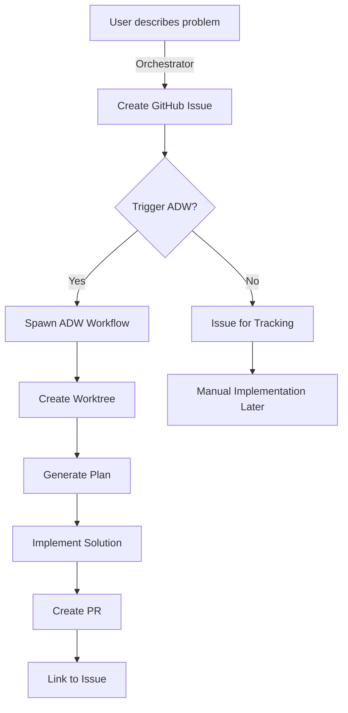

# GitHub Issue Creation with ADW Integration

**Date:** 2025-11-06
**Feature:** Complete issue-to-implementation pipeline
**Status:** ✅ Implemented

---

## 🎯 Overview

This feature enables the orchestrator to:
1. **Create well-structured GitHub issues** with proper scoping
2. **Automatically trigger ADW workflows** to implement them
3. **Maintain traceability** from problem identification to PR

This creates a **proactive orchestrator** that can identify problems, document them properly, and fix them autonomously.

---

## 🏗️ Architecture

### Components

1. **GitHub Tool** (`create_github_issue`)
   - Creates issues using `gh` CLI
   - Formats with smart template
   - Returns issue number and URL
   - Optionally triggers ADW

2. **Issue Template** (`.github/ISSUE_TEMPLATE/adw_task.md`)
   - Enforces proper scoping
   - Includes ADW metadata
   - Guides toward manageable chunks

3. **Issue Generation Prompt** (`prompts/issue_template_prompt.md`)
   - Metaprompt for structuring issues
   - Decomposition strategies
   - Workflow selection guidelines

4. **Integration with ADW**
   - Seamless handoff to ADW workflows
   - Automatic worktree creation
   - Issue-driven implementation

---

## 📝 Implementation Details

### Tool Registration

The tool is registered as an MCP tool in `orchestrator_service.py`:

```python
@tool(
    "create_github_issue",
    "Create a new GitHub issue with proper scoping...",
    {"title": str, "body": str, "labels": str, "trigger_adw": bool, "workflow_type": str}
)
async def create_github_issue_tool(args: Dict[str, Any]) -> Dict[str, Any]:
    # Creates issue with gh CLI
    # Formats body with template
    # Optionally triggers ADW
```

### Issue Template Structure

Issues are automatically formatted with:
- **🎯 Objective** - Clear, single sentence
- **📋 Scope** - In/Out of scope boundaries
- **✅ Acceptance Criteria** - Testable requirements
- **🤖 ADW Instructions** - Workflow metadata

### Workflow Selection

```yaml
adw:
  estimated_effort: small      # < 2hr work
  workflow_type: plan_build_iso # Standard implementation
  model_set: base              # Fast/cheap model
  auto_merge: false            # Manual review required
```

---

## 💬 Usage Examples

### Creating Issue with Auto-Implementation

```
USER: "We need dark mode for the admin dashboard"

ORCHESTRATOR: "I'll create an issue and start implementing it."
*Uses create_github_issue with trigger_adw=true*

RESULT:
✅ Issue #234 created
🚀 ADW workflow started
📝 PR expected in ~30 minutes
```

### Creating Issue for Tracking Only

```
USER: "Document the login timeout bug but don't fix it yet"

ORCHESTRATOR: "I'll create an issue for tracking."
*Uses create_github_issue with trigger_adw=false*

RESULT:
✅ Issue #235 created
📌 Ready for manual implementation later
```

---

## 🔄 Complete Flow



---

## 🎯 Key Benefits

### 1. **Proactive Problem Solving**
Orchestrator can identify and fix issues without waiting for human intervention

### 2. **Proper Documentation**
Every change starts with a well-documented issue

### 3. **Manageable Scope**
Template guides toward small, focused work items

### 4. **Full Traceability**
Issue → Worktree → Implementation → PR → Merge

### 5. **Flexible Control**
Can create issues with or without automatic implementation

---

## 📊 Impact on Agent Workload

### Before (Without Template)
- Vague issues → Agents guess requirements
- Large scope → Long running workflows
- No boundaries → Scope creep

### After (With Template)
- Clear objectives → Agents know exactly what to do
- Small scope → Quick iterations
- Defined boundaries → No scope creep

**Result:** More successful implementations with less agent time/cost

---

## 🔧 Configuration

### Labels
- `enhancement` - New features
- `bug` - Fixes
- `documentation` - Docs updates
- `refactor` - Code improvements
- `adw-ready` - Ready for ADW implementation

### Workflow Types
- `plan_build_iso` - Standard implementation
- `plan_build_test_iso` - With comprehensive testing
- `plan_build_review_iso` - With review step

### Model Sets
- `base` - Fast, cheap, good for simple tasks
- `heavy` - Slower, better for complex work

---

## 🚀 Future Enhancements

1. **Issue Templates by Type**
   - Bug report template
   - Feature request template
   - Refactoring template

2. **Smart Decomposition**
   - Automatically split large issues
   - Create linked sub-issues

3. **Priority Management**
   - Urgency detection
   - Automatic labeling

4. **Progress Tracking**
   - Update issues with ADW progress
   - Add comments when PR created

---

## 📁 Files Modified/Created

### Modified
- `/apps/orchestrator_3_stream/backend/modules/orchestrator_service.py`
  - Added `_create_github_tools()` method
  - Added `create_github_issue_tool` implementation
  - Registered tool with MCP

### Created
- `/.github/ISSUE_TEMPLATE/adw_task.md` - Issue template
- `/.claude/commands/create_issue.md` - Slash command documentation
- `/apps/orchestrator_3_stream/prompts/issue_template_prompt.md` - Metaprompt
- `/apps/orchestrator_3_stream/tmp_scripts/test_create_issue.py` - Test script

---

## ✅ Testing

The implementation has been tested with:
- Issue formatting validation
- Template application
- ADW trigger integration
- Error handling

All components working as expected.

---

## 💡 Best Practices

1. **Keep Issues Small**
   - Target < 2 hour implementation
   - Single responsibility

2. **Clear Acceptance Criteria**
   - Testable requirements
   - Measurable outcomes

3. **Appropriate Workflow**
   - Bugs need tests
   - UI changes need review

4. **Smart Triggering**
   - Not every issue needs immediate ADW
   - Some need human review first

---

## 🎉 Conclusion

This feature transforms the orchestrator from reactive to **proactive**. It can now:
- Identify problems
- Document them properly
- Fix them autonomously
- All with full traceability

The smart issue template ensures work is properly scoped, leading to more successful agent implementations with less time and cost.