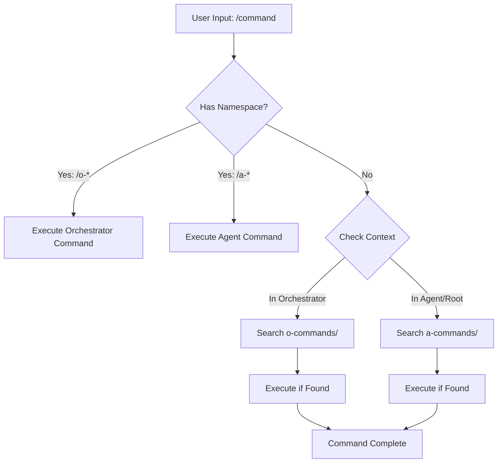

# Namespace Separation Strategy: O-Commands vs A-Commands

## Executive Summary

This document outlines a clean architectural solution for separating orchestrator commands (o-commands) from agent commands (a-commands) in the Ozean Licht monorepo, resolving command conflicts while maintaining operational clarity.

## Current Problem Analysis

### Command Conflicts
- **20 duplicate commands** exist between root and orchestrator contexts
- Commands like `/plan`, `/build`, `/reset` exist in both locations
- Multi-root workspace loads all commands, creating ambiguity
- No clear ownership boundaries between orchestrator and agent operations

### Discovery Issues
- Root context: 20 commands
- Orchestrator context: 20 commands (duplicates)
- Total potential conflicts: 100% overlap
- Users unclear which command variant executes

## Proposed Architecture

### 1. Namespace Design

```
┌─────────────────────────────────────────────┐
│           Repository Root                   │
├─────────────────────────────────────────────┤
│  .claude/                                   │
│  ├── o-claude.md    (Orchestrator config)   │
│  ├── a-claude.md    (Agent config)          │
│  ├── o-commands/   (Orchestrator commands) │
│  │   ├── o-scout-and-build.md              │
│  │   ├── o-plan-w-scouts.md                │
│  │   ├── o-trinity-mode.md                 │
│  │   └── o-parallel-agents.md              │
│  └── a-commands/   (Agent commands)        │
│      ├── a-plan.md                         │
│      ├── a-build.md                        │
│      ├── a-test.md                         │
│      └── a-prime.md                        │
└─────────────────────────────────────────────┘
```

### 2. Naming Conventions

#### Orchestrator Commands (o-*)
- **Purpose**: Complex multi-agent orchestration
- **Prefix**: `o-` (orchestrator)
- **Examples**:
  - `/o-scout-and-build` - Scout problem, then build solution
  - `/o-plan-w-scouts` - Planning with multiple scout agents
  - `/o-trinity-mode` - Three-phase workflow
  - `/o-parallel-agents` - Concurrent agent execution

#### Agent Commands (a-*)
- **Purpose**: Single-responsibility agent tasks
- **Prefix**: `a-` (agent)
- **Examples**:
  - `/a-plan` - Create implementation plan
  - `/a-build` - Build codebase
  - `/a-test` - Run test suites
  - `/a-review` - Code review

### 3. Configuration Files

#### o-claude.md (Orchestrator Configuration)
```markdown
---
type: orchestrator
namespace: o-*
priority: high
tools: Task, Bash, Read, Write, Edit, Glob, Grep, TodoWrite
model: sonnet
---

# Orchestrator Configuration

Configuration for multi-agent orchestration workflows.
Handles complex, multi-step operations requiring agent coordination.
```

#### a-claude.md (Agent Configuration)
```markdown
---
type: agent
namespace: a-*
priority: normal
tools: Read, Write, Edit, Bash, Grep, Glob
model: haiku
---

# Agent Configuration

Configuration for single-responsibility agent operations.
Handles focused, specific tasks within defined boundaries.
```

### 4. Migration Strategy

#### Phase 1: Preparation (Day 1)
1. Backup existing `.claude/` directory
2. Create namespace directories: `o-commands/`, `a-commands/`
3. Generate configuration files: `o-claude.md`, `a-claude.md`

#### Phase 2: Command Migration (Day 2-3)
```bash
# Orchestrator commands (o-*)
mv .claude/commands/orch_*.md .claude/o-commands/
rename 's/orch_/o-/' .claude/o-commands/*.md

# Agent commands (a-*)
mv .claude/commands/*.md .claude/a-commands/
rename 's/^/a-/' .claude/a-commands/*.md
```

#### Phase 3: Update References (Day 4)
1. Update workspace configuration
2. Modify command discovery logic
3. Update documentation references
4. Test multi-root workspace

#### Phase 4: Validation (Day 5)
1. Test all commands in isolated contexts
2. Verify namespace precedence
3. Validate backward compatibility
4. Performance testing

### 5. Workspace Configuration

```json
{
  "folders": [
    {
      "name": "🏠 Root (a-commands)",
      "path": ".",
      "settings": {
        "claude.commands.namespace": "a-*",
        "claude.commands.path": ".claude/a-commands"
      }
    },
    {
      "name": "🤖 Orchestrator (o-commands)",
      "path": "apps/orchestrator_3_stream",
      "settings": {
        "claude.commands.namespace": "o-*",
        "claude.commands.path": ".claude/o-commands"
      }
    }
  ],
  "settings": {
    "claude.commands.scanWorkspace": true,
    "claude.commands.namespaceMode": "strict",
    "claude.commands.conflictResolution": "namespace-prefix"
  }
}
```

### 6. Command Discovery Precedence



### 7. Backward Compatibility

#### Alias Mapping
```yaml
aliases:
  # Legacy → New
  /orch_scout_and_build: /o-scout-and-build
  /plan: /a-plan
  /build: /a-build
  /orch_trinity_mode: /o-trinity-mode
```

#### Deprecation Timeline
- **Week 1-2**: Both namespaces active, warnings for legacy
- **Week 3-4**: Legacy commands show deprecation notices
- **Month 2**: Remove legacy command support

### 8. Benefits

#### Clear Separation of Concerns
- Orchestrator handles multi-agent coordination
- Agents handle single-responsibility tasks
- No command ambiguity

#### Improved Discoverability
- Namespace prefixes indicate command type
- Autocomplete groups by namespace
- Context-aware suggestions

#### Scalability
- Easy to add new namespaces (t-* for test, d-* for deploy)
- Modular command organization
- Plugin-friendly architecture

### 9. Implementation Checklist

#### Pre-Migration
- [ ] Backup current `.claude/` directory
- [ ] Document all existing commands
- [ ] Notify team of upcoming changes
- [ ] Create rollback plan

#### Migration
- [ ] Create namespace directories
- [ ] Generate configuration files
- [ ] Migrate orchestrator commands to o-*
- [ ] Migrate agent commands to a-*
- [ ] Update workspace settings
- [ ] Implement alias mapping

#### Post-Migration
- [ ] Test all commands
- [ ] Update documentation
- [ ] Train team on new structure
- [ ] Monitor for issues

#### Validation
- [ ] No command conflicts
- [ ] All commands discoverable
- [ ] Backward compatibility works
- [ ] Performance acceptable

### 10. Future Extensions

#### Additional Namespaces
- `t-*` - Test commands
- `d-*` - Deployment commands
- `m-*` - Monitoring commands
- `u-*` - Utility commands

#### Dynamic Command Loading
```javascript
// Proposed command loader
class CommandLoader {
  async loadNamespace(prefix) {
    const commands = await glob(`${prefix}commands/${prefix}*.md`);
    return commands.map(cmd => new Command(cmd));
  }
}
```

### 11. Risk Mitigation

#### Risk: User Confusion
- **Mitigation**: Comprehensive documentation, training sessions
- **Fallback**: Alias mapping for transition period

#### Risk: Breaking Changes
- **Mitigation**: Backward compatibility layer
- **Fallback**: Instant rollback capability

#### Risk: Performance Impact
- **Mitigation**: Lazy loading of namespaces
- **Fallback**: Cache command registry

### 12. Success Metrics

- **Zero command conflicts** after migration
- **100% command discoverability** in all contexts
- **<100ms command resolution** time
- **95% user satisfaction** with new structure

## Conclusion

This namespace separation strategy provides a clean, scalable solution for managing orchestrator and agent commands in the monorepo. The o-*/a-* prefix convention creates clear boundaries while maintaining flexibility for future growth.

## Next Steps

1. Review and approve strategy with team
2. Execute Phase 1: Preparation
3. Deploy namespace-architect agent
4. Begin incremental migration
5. Monitor and adjust based on feedback

---

**Document Version**: 1.0
**Last Updated**: 2025-01-01
**Author**: Namespace Architect Agent
**Status**: Ready for Implementation