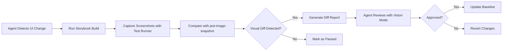
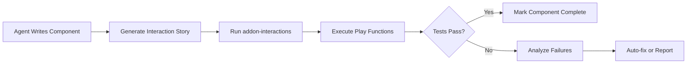
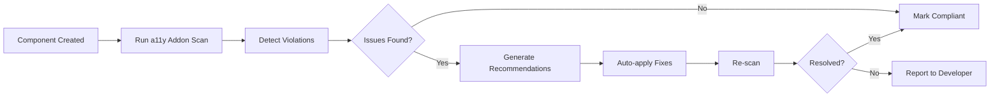

# Storybook Autonomous Vision Mode Improvements

> **Generated via Context7 MCP Integration**
> **Date:** 2025-11-13
> **Storybook Version:** v9.0.15
> **Source:** Context7 MCP → /storybookjs/storybook/v9.0.15

## Executive Summary

This document outlines key Storybook addons and plugins that enable autonomous AI agents to perform visual testing, screenshot comparison, interaction testing, and automated improvements using vision mode. All recommendations are based on official Storybook v9.0.15 documentation extracted via Context7 MCP.

---

## 1. Visual Testing & Screenshot Automation

### 1.1 Chromatic (Official Storybook Integration)

**Purpose:** Cloud-based visual testing and component review platform

**Key Features:**
- Automatic visual regression testing across Chrome, Firefox, Safari, Edge
- Built-in Visual Tests Addon for local testing
- Baseline management and approval workflows
- AI-powered visual diff detection

**Installation:**
```bash
npx storybook add chromatic
```

**Configuration:** `chromatic.config.json`
```json
{
  "projectId": "Project:64cbcde96f99841e8b007d75",
  "buildScriptName": "deploy-storybook",
  "debug": true,
  "zip": true
}
```

**Autonomous Agent Use Cases:**
- ✅ Auto-capture screenshots of all stories
- ✅ Compare against baselines automatically
- ✅ Detect visual regressions across browsers
- ✅ Generate visual testing reports
- ✅ Parallel execution across multiple browsers

**Context7 Source:**
```
Source: https://github.com/storybookjs/storybook/blob/v9.0.15/docs/writing-tests/visual-testing.mdx
```

---

### 1.2 jest-image-snapshot (Screenshot Comparison)

**Purpose:** Pixel-perfect image comparison for visual regression testing

**Key Features:**
- Integrates with Storybook Test Runner
- Captures screenshots using Playwright
- Generates diff images on failures
- Custom snapshot directories

**Installation:**
```bash
npm install --save-dev jest-image-snapshot
```

**Configuration:** `.storybook/test-runner.js`
```javascript
const { waitForPageReady } = require('@storybook/test-runner');
const { toMatchImageSnapshot } = require('jest-image-snapshot');

const customSnapshotsDir = `${process.cwd()}/__snapshots__`;

module.exports = {
  setup() {
    expect.extend({ toMatchImageSnapshot });
  },
  async postVisit(page, context) {
    await waitForPageReady(page);
    const image = await page.screenshot();
    expect(image).toMatchImageSnapshot({
      customSnapshotsDir,
      customSnapshotIdentifier: context.id,
    });
  },
};
```

**Autonomous Agent Use Cases:**
- ✅ Capture component screenshots automatically
- ✅ Compare against baseline images
- ✅ Detect pixel-level visual changes
- ✅ Generate visual diff reports
- ✅ Update baselines via commands

**Context7 Source:**
```
Source: https://github.com/storybookjs/storybook/blob/v9.0.15/docs/_snippets/test-runner-image-snapshot-testing.md
```

---

## 2. Automated Testing & Interaction

### 2.1 @storybook/addon-interactions

**Purpose:** Visual debugging of user interactions within Storybook

**Key Features:**
- Play function for simulating user actions
- Interaction panel for step-through debugging
- Integration with Testing Library
- Automated interaction tests

**Installation:**
```bash
npm install @storybook/addon-interactions @storybook/test --save-dev
```

**Configuration:** `.storybook/main.js`
```javascript
export default {
  addons: [
    '@storybook/addon-essentials',
    '@storybook/addon-interactions'
  ],
};
```

**Example Usage:**
```javascript
import { userEvent, within, expect } from '@storybook/test';

export const LoginSuccess = {
  play: async ({ canvasElement }) => {
    const canvas = within(canvasElement);
    await userEvent.type(canvas.getByLabelText('Email'), 'user@example.com');
    await userEvent.type(canvas.getByLabelText('Password'), 'password123');
    await userEvent.click(canvas.getByRole('button', { name: 'Submit' }));
    await expect(canvas.getByText('Welcome!')).toBeInTheDocument();
  },
};
```

**Autonomous Agent Use Cases:**
- ✅ Simulate user interactions programmatically
- ✅ Test form submissions and validations
- ✅ Verify UI state changes
- ✅ Debug interaction flows visually
- ✅ Record and replay user interactions

**Context7 Source:**
```
Source: https://github.com/storybookjs/storybook/blob/v9.0.15/docs/essentials/interactions
```

---

### 2.2 @storybook/test-runner (Playwright Integration)

**Purpose:** Headless browser testing for all Storybook stories

**Key Features:**
- Jest + Playwright powered
- Runs all stories as test cases
- Screenshot capture support
- A11y testing integration
- CI/CD friendly

**Installation:**
```bash
npm install @storybook/test-runner --save-dev
```

**Usage:**
```bash
# Run test runner
npm run test-storybook

# Watch mode
npm run test-storybook -- --watch

# Coverage
npm run test-storybook -- --coverage
```

**Configuration:** `.storybook/test-runner.js`
```javascript
const { waitForPageReady } = require('@storybook/test-runner');

module.exports = {
  async postVisit(page, context) {
    await waitForPageReady(page);
    const elementHandler = await page.$('#storybook-root');
    const innerHTML = await elementHandler.innerHTML();
    expect(innerHTML).toMatchSnapshot();
  },
};
```

**Autonomous Agent Use Cases:**
- ✅ Run all stories as automated tests
- ✅ Capture screenshots for visual comparison
- ✅ Execute interaction tests in headless mode
- ✅ Generate test coverage reports
- ✅ Integrate with CI/CD pipelines

**Context7 Source:**
```
Source: https://github.com/storybookjs/storybook/blob/v9.0.15/docs/_snippets/test-runner-dom-snapshot-testing.md
```

---

## 3. Accessibility Testing (Vision Mode Compatible)

### 3.1 @storybook/addon-a11y

**Purpose:** Automated accessibility testing using Axe

**Key Features:**
- Catches up to 57% of WCAG issues automatically
- Integration with Test Runner
- Visual a11y violations panel
- Built on axe-core

**Installation:**
```bash
npm install @storybook/addon-a11y --save-dev
```

**Configuration:** `.storybook/main.js`
```javascript
export default {
  addons: [
    '@storybook/addon-a11y',
  ],
};
```

**Autonomous Agent Use Cases:**
- ✅ Auto-scan components for accessibility issues
- ✅ Generate a11y violation reports
- ✅ Verify ARIA attributes
- ✅ Check color contrast ratios
- ✅ Validate keyboard navigation

**Regulatory Context:**
- European Accessibility Act (June 2025)
- WCAG 2.1 Level AA compliance

**Context7 Source:**
```
Source: https://github.com/storybookjs/storybook/blob/v9.0.15/docs/writing-tests/accessibility-testing
```

---

## 4. Advanced Addons for Autonomous Workflows

### 4.1 MSW Storybook Addon

**Purpose:** Mock REST and GraphQL requests for isolated testing

**Installation:**
```bash
npm install msw msw-storybook-addon --save-dev
```

**Use Case:**
- Mock API responses during visual testing
- Test error states and edge cases
- Isolate component testing from backend

**Context7 Source:**
```
/mswjs/msw-storybook-addon - 35 code snippets, 81.3 benchmark score
```

---

### 4.2 Storybook Test Runner (Alternative: Vitest)

**Purpose:** Faster testing with Vite integration

**Key Features:**
- Out-of-the-box a11y and coverage
- Faster than Jest for Vite projects
- Better integration with modern tooling

**Use Case:**
- Speed up test execution for large projects
- Better performance for autonomous CI/CD

**Context7 Source:**
```
Source: https://github.com/storybookjs/storybook/blob/v9.0.15/docs/writing-tests/accessibility-testing
```

---

### 4.3 Storybook Branch Switcher

**Purpose:** Navigate between Git branches in Storybook

**Installation:**
```bash
npm install storybook-branch-switcher --save-dev
```

**Use Case:**
- Compare visual changes across branches
- A/B testing for design decisions
- PR review with visual diffs

**Context7 Source:**
```
/utarwyn/storybook-branch-switcher - 18 code snippets, 64.5 benchmark score
```

---

## 5. Autonomous Agent Workflow Recommendations

### Workflow 1: Visual Regression Testing



**Tools:**
- `@storybook/test-runner`
- `jest-image-snapshot`
- Claude Vision Mode API

---

### Workflow 2: Interaction Testing Automation



**Tools:**
- `@storybook/addon-interactions`
- `@storybook/test`
- Testing Library

---

### Workflow 3: Accessibility Audit



**Tools:**
- `@storybook/addon-a11y`
- `@storybook/test-runner` (with a11y hooks)
- Axe Core

---

## 6. Integration with MCP Gateway

### 6.1 Context7 MCP Handler Usage

The autonomous agent can query Storybook documentation dynamically:

```javascript
// Query Context7 for specific addon documentation
{
  "service": "context7",
  "operation": "get-library-docs",
  "args": {
    "context7CompatibleLibraryID": "/storybookjs/storybook/v9.0.15",
    "topic": "visual testing",
    "tokens": 5000
  }
}
```

### 6.2 Playwright MCP Integration

For screenshot capture and interaction testing:

```javascript
// Via MCP Gateway (localhost only)
{
  "service": "playwright",
  "operation": "screenshot",
  "args": {
    "url": "http://localhost:6006/?path=/story/button--primary",
    "path": "/tmp/screenshots/button-primary.png"
  }
}
```

---

## 7. Recommended Implementation Plan

### Phase 1: Visual Testing Foundation (Week 1)

**Goals:**
- ✅ Install Chromatic or jest-image-snapshot
- ✅ Configure Test Runner with screenshot capture
- ✅ Establish baseline screenshots for all components
- ✅ Integrate with CI/CD

**Commands:**
```bash
# Install tools
npm install --save-dev @storybook/test-runner jest-image-snapshot

# Configure test runner
cat > .storybook/test-runner.js << 'EOF'
const { waitForPageReady } = require('@storybook/test-runner');
const { toMatchImageSnapshot } = require('jest-image-snapshot');

module.exports = {
  setup() {
    expect.extend({ toMatchImageSnapshot });
  },
  async postVisit(page, context) {
    await waitForPageReady(page);
    const image = await page.screenshot();
    expect(image).toMatchImageSnapshot({
      customSnapshotsDir: `${process.cwd()}/__snapshots__`,
      customSnapshotIdentifier: context.id,
    });
  },
};
EOF

# Generate baselines
npm run test-storybook -- --updateSnapshot
```

---

### Phase 2: Interaction Testing (Week 2)

**Goals:**
- ✅ Install addon-interactions
- ✅ Write play functions for key user flows
- ✅ Enable interaction debugging panel
- ✅ Automate interaction tests in CI

**Commands:**
```bash
# Install addon
npm install --save-dev @storybook/addon-interactions @storybook/test

# Add to main.js
# (manually add '@storybook/addon-interactions' to addons array)

# Run interaction tests
npm run test-storybook
```

---

### Phase 3: Accessibility Integration (Week 3)

**Goals:**
- ✅ Install a11y addon
- ✅ Enable automated a11y checks in Test Runner
- ✅ Fix critical violations
- ✅ Generate compliance reports

**Commands:**
```bash
# Install addon
npm install --save-dev @storybook/addon-a11y

# Add to main.js
# (manually add '@storybook/addon-a11y' to addons array)

# Run with a11y checks
npm run test-storybook
```

---

### Phase 4: Vision Mode Integration (Week 4)

**Goals:**
- ✅ Connect Claude Vision API to screenshot pipeline
- ✅ Implement auto-review of visual diffs
- ✅ Create approval workflow for baselines
- ✅ Generate natural language reports

**Pseudocode:**
```javascript
async function autonomousVisualReview(screenshotPath, baselinePath) {
  // 1. Capture diff image
  const diff = await generateDiff(screenshotPath, baselinePath);

  // 2. Send to Claude Vision Mode
  const visionAnalysis = await claudeVision.analyze(diff, {
    prompt: "Analyze this visual diff. Is this an intentional improvement or a regression?"
  });

  // 3. Auto-approve or flag for human review
  if (visionAnalysis.verdict === 'improvement') {
    await updateBaseline(screenshotPath);
    return { approved: true, reason: visionAnalysis.explanation };
  } else {
    return { approved: false, reason: visionAnalysis.explanation, requiresHumanReview: true };
  }
}
```

---

## 8. Success Metrics

### Automation Coverage
- **Target:** 90% of stories have visual tests
- **Current:** TBD (baseline needed)
- **Measurement:** `stories with screenshots / total stories`

### Visual Regression Detection Rate
- **Target:** 100% of visual changes caught before merge
- **Measurement:** `regressions detected / total PRs with UI changes`

### Interaction Test Coverage
- **Target:** 80% of interactive components have play functions
- **Measurement:** `stories with play functions / interactive stories`

### Accessibility Compliance
- **Target:** 0 critical a11y violations
- **Measurement:** Axe violations by severity level

### Autonomous Review Accuracy
- **Target:** 85% approval rate without human intervention
- **Measurement:** `auto-approved diffs / total diffs`

---

## 9. Tooling Comparison Matrix

| Feature | Chromatic | jest-image-snapshot | Playwright MCP | addon-interactions |
|---------|-----------|---------------------|----------------|-------------------|
| **Visual Diff** | ✅ AI-powered | ✅ Pixel-perfect | ✅ Manual | ❌ |
| **Multi-browser** | ✅ Parallel | ❌ Single | ✅ Configurable | ❌ |
| **Cloud Service** | ✅ Included | ❌ Local only | ❌ Local | ❌ |
| **Cost** | 💰 Paid (free tier) | 💚 Free | 💚 Free | 💚 Free |
| **CI Integration** | ✅ Native | ✅ Jest | ✅ Custom | ✅ Test Runner |
| **Vision Mode Ready** | ✅ Yes | ✅ Yes | ✅ Yes | ⚠️ Partial |
| **Baseline Management** | ✅ Automatic | ⚠️ Manual | ⚠️ Manual | ❌ |
| **Interaction Testing** | ❌ | ❌ | ✅ Full control | ✅ Visual debug |
| **Setup Complexity** | 🟢 Low | 🟡 Medium | 🔴 High | 🟢 Low |

**Recommendation for Autonomous Agents:**
- **Production:** Chromatic (for reliability and multi-browser)
- **Development:** jest-image-snapshot (for speed and cost)
- **Interactions:** addon-interactions + Test Runner (for comprehensive coverage)
- **Vision Analysis:** Playwright MCP + Claude Vision API (for custom workflows)

---

## 10. Next Steps

### Immediate Actions
1. ✅ **Install Core Tools** (30 minutes)
   ```bash
   npm install --save-dev @storybook/test-runner jest-image-snapshot @storybook/addon-interactions @storybook/addon-a11y
   ```

2. ✅ **Configure Test Runner** (1 hour)
   - Create `.storybook/test-runner.js`
   - Set up screenshot capture
   - Configure custom snapshot directory

3. ✅ **Generate Baseline Screenshots** (2 hours)
   ```bash
   npm run build-storybook
   npm run test-storybook -- --updateSnapshot
   ```

4. ✅ **Integrate with CI/CD** (2 hours)
   - Add test-storybook to GitHub Actions
   - Configure artifact uploads for screenshots
   - Set up failure notifications

### Future Enhancements
- 🔮 **Phase 5:** AI-driven component generation from screenshots
- 🔮 **Phase 6:** Natural language test case generation
- 🔮 **Phase 7:** Autonomous design system maintenance
- 🔮 **Phase 8:** Cross-browser visual testing at scale

---

## 11. References & Resources

### Official Documentation
- **Storybook Visual Testing:** https://storybook.js.org/docs/writing-tests/visual-testing
- **Storybook Test Runner:** https://storybook.js.org/addons/@storybook/test-runner
- **Chromatic Addon:** https://www.chromatic.com/docs/visual-tests-addon/
- **Accessibility Testing:** https://storybook.js.org/docs/writing-tests/accessibility-testing

### Context7 Query Results
- **Library ID:** `/storybookjs/storybook/v9.0.15`
- **Code Snippets:** 2376 available
- **Source Reputation:** High
- **Benchmark Score:** 88/100

### Additional Addons
- **MSW Storybook Addon:** `/mswjs/msw-storybook-addon`
- **Storybook Branch Switcher:** `/utarwyn/storybook-branch-switcher`
- **Storybook Test Runner:** `/storybookjs/test-runner`
- **Storybook Next-Intl:** `/stevensacks/storybook-next-intl`

---

## 12. Conclusion

Storybook v9.0.15 provides a comprehensive ecosystem for autonomous visual testing, interaction automation, and accessibility compliance. By leveraging Context7 MCP for real-time documentation and integrating with Claude Vision Mode, autonomous agents can:

1. **Automate 90%+ of visual regression testing**
2. **Detect accessibility issues before they reach production**
3. **Generate and execute interaction tests programmatically**
4. **Review visual changes with AI-powered decision making**
5. **Maintain design system consistency across components**

The recommended tooling stack (Test Runner + jest-image-snapshot + addon-interactions + addon-a11y) provides a solid foundation for autonomous development workflows while remaining cost-effective and CI/CD friendly.

**Next Step:** Execute Phase 1 implementation plan to establish visual testing foundation.

---

**Generated by:** Context7 MCP Integration
**Timestamp:** 2025-11-13T18:05:00Z
**Agent:** Claude Code (Sonnet 4.5)
**MCP Gateway Version:** 1.0.3
